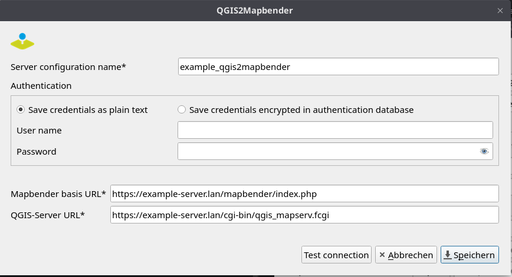

# QGIS2Mapbender

## Description
QGIS plugin to transfer your QGIS Server project on your server and publish your QGIS Server WMS in Mapbender.

## Installation and Requirements
### Installing the plugin
Installation is possible directly from the QGIS plugin repository.
Alternatively, a release can be downloaded here and the zipped folder can be installed manually as a QGIS extension. There are no further dependencies.

### Requirements on your local system
- The QGIS project must be saved in the same folder as the data.

### Requirements on your server
- QGIS Server is installed on your server.
- Mapbender is installed on your server.
- Configure Apache authorisation and upload directory (see https://doc.mapbender.org/en/customization/api.html)
- Configure the parameters "upload_max_filesize" and "post_max_size" (maximum size of all data sent via a POST request, its value should be equal to or greater than upload_max_filesize) in php.ini to match the characteristics of the projects you plan to upload to the server. Remember that the folder containing your project and data will be zipped for uploading to the server.
- Create at least one template application in Mapbender (that will be cloned and used to publish a new WMS) or an application that will be used to publish a new WMS. 

  These applications should have at least one instance of a map and one layerset: 
  - layerset named "main" OR 
  - layerset named with any other name.
  
  The field "layerset" in QGIS2Mapbender is the id or name of the layerset to clone or use. Defaults to "main" or the first layerset in the application.

### Configuring the connection to the server 
The figure below shows a typical configuration of the connection to the server.

A few comments on a standard configuration:

| **Parameter**          | **Description**                                           | **Example**                          |
|------------------------|-----------------------------------------------------------|------------------------------------------------|
| **Mapbender base URL** | The URL where all your Mapbender applications are listed. | https://example-server.lan/mapbender/index.php  |                                                                                                                                  |
| **QGIS-Server URL:**   | The URL to access your QGIS Server services.              | https://example-server.lan/cgi-bin/qgis_mapserv.fcgi    |

## Support
info@wheregroup.com

## License
The plugin is licensed under the attached GNU General Public License.
