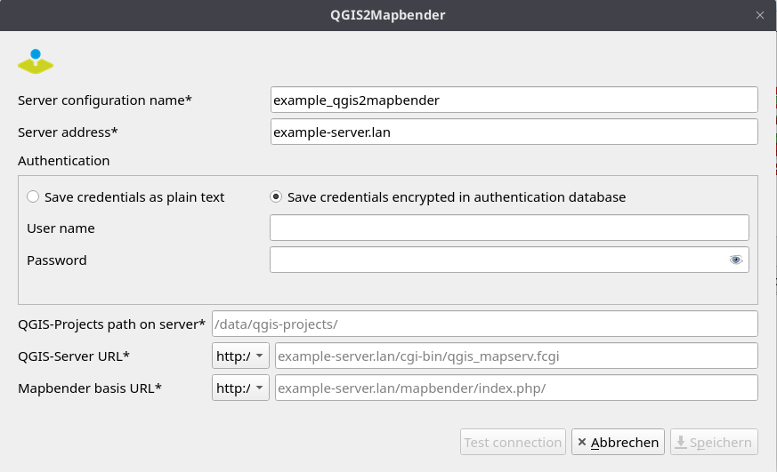

# QGIS2Mapbender

## Description
QGIS plugin to transfer your QGIS Server project on your server and publish your QGIS Server WMS in Mapbender.

## Installation and Requirements
### Installing the plugin
Installation is possible directly from the QGIS plugin repository.
Alternatively, a release can be downloaded here and the zipped folder can be installed manually as a QGIS extension. There are no further dependencies.

### Requirements on your local system
- The QGIS project must be saved in the same folder as the data.

### Requirements on your server
- QGIS Server is installed on your server.
- Mapbender is installed on your server.
- Configure Apache authorisation and upload directory (see https://doc.mapbender.org/en/customization/api.html)
- Create at least one template application in Mapbender (that will be cloned and used to publish a new WMS) or an application that will be used to publish a new WMS. These applications should have at least one layerset: 
  - layerset named "main" (default layerset for adding a new WMS to the application) OR 
  - layerset named with any other name (in this case, the name of the layerset should be specified when using the plugin)

### Configuring the connection to the server 
The figure below shows a typical configuration of the connection to the server.

A few comments on a standard configuration:

| **Description**                                                                                                                                                                                                                                | **Example**                                                                                                                                                                          |
|:-----------------------------------------------------------------------------------------------------------------------------------------------------------------------------------------------------------------------------------------------|:-------------------------------------------------------------------------------------------------------------------------------------------------------------------------------------|
| **QGIS-Projects Path:** This is the path on the server where QGIS projects are uploaded.                                                                                                                                                       | /data/qgis-projects                                                                                                                                                                  |
| 
**QGIS-Server URL:** The path from the server address to access QGIS Server services.

                                                                                                                       | example-server.lan/cgi-bin/qgis_mapserv.fcgi|
| **Mapbender Base URL:** The home page of Mapbender where all applications are listed.                                                                                                                                                          | mapbender/                                                                                                                                                                           |

## Support
info@wheregroup.com

## License
The plugin is licensed under the attached GNU General Public License.
