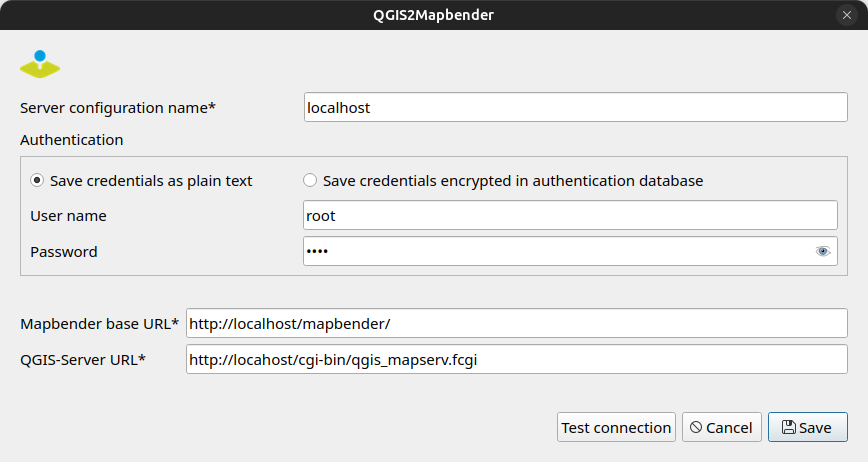

# QGIS2Mapbender

## Description
The QGIS2Mapbender plugin transfers your local QGIS project on a server and publishes the QGIS Server WMS in a Mapbender application.

You find the QGIS2Mapbender in the QGIS Python Plugins Repository https://plugins.qgis.org/plugins/qgis2mapbender.


## Installation and Requirements

Please note that QGIS2Mapbender version >= 1.0.0 needs Mapbender version >= 4.1.3.

### Installing the plugin
QGIS2Mapbender is published in the QGIS plugin repository. The installation is possible directly from the QGIS plugin repository via the QGIS Plugin Manager. Click on the menu item **Plugins ► Manage and Install Plugins**.
Alternatively, a release can be downloaded here. The zipped folder can be installed manually. Click on the menu item **Plugins  ► Manage and Install Plugins**. Select the **Not Installed option** in the Plugin Manager dialog and upload the zip.

### Requirements on your local system
- For local QGIS projects, the QGIS project must be saved in the same folder as the data. Please note that, along with the QGIS project, all the files in the folder containing the QGIS project will also be uploaded to the server.
- QGIS projects stored in a PostgreSQL database are also supported.

### Requirements on your server
- QGIS Server is installed on your server.
- Mapbender is installed and configured on your server.
- Additional information about the requirements for PostgreSQL-stored projects is provided below.

### Requirements for your Mapbender installation

**Apache**
- Configure Apache authorisation and the Mapbender upload directory **api_upload_dir** (see https://doc.mapbender.org/en/customization/api.html)


**PHP**
- Configure the following parameters in php.ini to match the characteristics of the projects you plan to upload to the server. Remember that the folder containing your project and data will be zipped for uploading to the server.

  - **upload_max_filesize** - the maximum size of an uploaded file. 
  - **post_max_size** - maximum size of all data sent via a POST request, its value should be equal to or greater than upload_max_filesize.
  - **max_execution_time** - this sets the maximum time in seconds a script is allowed to parse input data.


**Mapbender**

- Application: Create at least one template application in Mapbender (that can be copied and can be used to publish a new WMS) or an application that will be used directly to publish a new WMS. 

- The applications should have at least one instance of a map and one layerset.
  
 Note: The field "layerset" in QGIS2Mapbender is the id or name of the layerset to use. Defaults are "main" or the first layerset in the application.

- User/Groups: All Mapbender users that should be authorized to use QGIS2Mapbender need special rights. There is only one exception and this is the Mapbender super user with the id 1, where this permission is automatically granted. 

  - User/group needs to have the global permission **access_api** and **upload_files** in order to perform any operation on the API and to be able to upload files.
  - User/group needs the global permission **view_sources**.
  - User/group needs the global permission **create_applications** to copy an application.
  - User/group need to have **view** rights on the template application to copy an application.
  - User/group needs the global permission **edit_applications** to update an application with a new source.
  - User/group needs the global permission **edit_soruces** to create a new source (publish).
  - User/group needs the global permission **update_soruces** to reload a source.


### Configuring the connection to the server 

The figure below shows a typical configuration of the connection to the server.



A few comments on a standard configuration:

| **Parameter**                                      | **Description**                                           | **Example**                          |
|----------------------------------------------------|-----------------------------------------------------------|-----------------------------------------------|
| **Mapbender base URL**                             | Link to your Mapbender landing page (application overview) | http://localhost/mapbender/  |                                                                                                                                  |
| **QGIS Server URL (for standard local projects)**  | URL to access your QGIS Server              | http://localhost/cgi-bin/qgis_mapserv.fcgi   |
| **QGIS Server URL (for PostgreSQL QGIS projects)** | Apache wrapper URL for QGIS projects stored in PostgreSQL | http://localhost/qgis/ |


### Deployment modes

The plugin supports both a standard Linux installation and Docker
deployments. No Docker-specific setting is required in the plugin; configure
the URLs and server-side paths for the deployment being used.

For local `.qgs` or `.qgz` projects, keep using the direct QGIS Server URL
(for example `/cgi-bin/qgis_mapserv.fcgi`). The upload workflow is unchanged.

For PostgreSQL projects, use the Apache wrapper URL described below when the
wrapper is installed in the same environment as QGIS Server.

When QGIS Server and Mapbender run as Docker containers, make sure that the
Mapbender upload directory **api_upload_dir** has the same path as the QGIS
Server project directory, as it is used in the QGIS Server request as the
`MAP` path. A default QGIS project (`QGIS_PROJECT_FILE`) should **not** be
specified.

### PostgreSQL projects with the Apache wrapper (Linux)

For a QGIS project stored in PostgreSQL, the plugin sends only the public
project name and schema to the `/qgis/` endpoint. The wrapper adds the
PostgreSQL service name on the server and QGIS Server resolves the connection
through libpq. This avoids putting database connection details in the public
WMS URL.

Select this public `/qgis/` endpoint in the plugin's QGIS Server URL setting
for PostgreSQL projects; use the direct QGIS Server endpoint for local
projects.

The wrapper is a server-side integration, not a plugin runtime dependency. The
templates are versioned in the repository under
[`scripts/`](https://github.com/WhereGroup/QGIS2Mapbender/tree/main/scripts) and
are not included in the QGIS plugin ZIP.

The server files have the following roles:

| File | Required for | Server location |
|------|--------------|-----------------|
| `qgis_mapserv_wrapper.sh` | PostgreSQL projects exposed through Apache | `/data/bin/qgis_mapserv_wrapper.sh` |
| `qgis-server-apache.conf` | Apache alias and process environment | `/etc/apache2/conf-available/qgis_server.conf` |
| `qgisserver.env.example` | Wrapper deployment settings | `/data/bin/qgisserver.env` |

Create `pg_service.conf`on the QGIS Server host or container with a service section matching
`QGIS_DB_SERVICE`, for example:

```ini
[replace_with_service_name]
host=replace_with_postgresql_host
port=5432
dbname=replace_with_database
user=replace_with_user
password=replace_with_password
```

Replace every placeholder with the values for the target deployment. Protect
the file so only the QGIS Server process can read it. No `.pgpass` file or
`PGPASSFILE` setting is required.

On Debian or Ubuntu, install the wrapper, its deployment settings, the
server-side service file, and the Apache configuration as follows. Replace
`www-data` with the user that runs the QGIS Server CGI process:

```bash
sudo install -d -o root -g www-data -m 0750 /data/bin /data/config
sudo install -o root -g www-data -m 0755 \
  scripts/qgis_mapserv_wrapper.sh /data/bin/qgis_mapserv_wrapper.sh
sudo install -o root -g www-data -m 0640 \
  scripts/qgisserver.env.example /data/bin/qgisserver.env
sudo install -o root -g www-data -m 0640 \
  /dev/null /data/config/pg_service.conf
sudo install -o root -g root -m 0644 \
  scripts/qgis-server-apache.conf \
  /etc/apache2/conf-available/qgis_server.conf
```

Edit `/data/bin/qgisserver.env` and `/data/config/pg_service.conf`. The
`QGIS_SERVER_BASE_URL` must be the `/qgis/` URL that Mapbender can use, while
`QGIS_SERVER_FCGI` must point to the QGIS Server FastCGI executable on the
same host. The `port` in `pg_service.conf` is the port reachable from the
QGIS Server host; it may differ from a local development port. The service
file does not contain `schema` or `project`: those identify the project in the
WMS request.

The QGIS Server package or container must provide the
PostgreSQL provider and its libpq runtime dependency. 

If the QGIS Server environment is a Docker container, make the wrapper,
`qgisserver.env`, and `pg_service.conf` available inside that container and
use paths that exist inside it in `qgis-server-apache.conf` and
`qgisserver.env`. Apache with `mod_fcgid` and the wrapper must run in the same
container as the QGIS Server FastCGI executable. These files do not configure
a wrapper in a separate Mapbender container. If only PostgreSQL and/or
Mapbender are containerized, install the wrapper on the QGIS Server host as
usual and use the published database address and port in `pg_service.conf`.

If Mapbender and QGIS Server share a Docker network,
`QGIS_SERVER_BASE_URL` may use the QGIS Server service name (for example
`http://qgis-server/qgis/`); otherwise use a reverse-proxy or host address
reachable by Mapbender. The URL does not need to be reachable from QGIS
Desktop, but the configured Mapbender base URL must be reachable from QGIS
Desktop because the plugin calls the Mapbender API. The `host` and `port` in
`pg_service.conf` must likewise be reachable from the QGIS Server host or
container; a Docker service name works only when that runtime shares the
corresponding Docker network.

The database must contain the `qgis_projects` table and the schema/project
specified by the public request. The same server-side service configuration
may also be needed by PostgreSQL layers referenced by the project.

Enable the Apache configuration and reload Apache:

```bash
sudo a2enmod cgi env fcgid
sudo a2enconf serve-cgi-bin
sudo a2enconf qgis_server
sudo apachectl configtest
sudo systemctl reload apache2
```

The name `qgis_server.conf` is a Debian/Ubuntu convention, not a QGIS Server
requirement. An installed file named `qgis-server-apache.conf` is also valid;
in that case enable it with `sudo a2enconf qgis-server-apache`.

## Support
info@wheregroup.com

## License
The plugin is licensed under the attached GNU General Public License.

## Translations

Translation files are placed in the folder qgis2mapbender/i18n of the plugin. If you want to contribute a translation, please have a look at the CONTRIBUTE.md file.