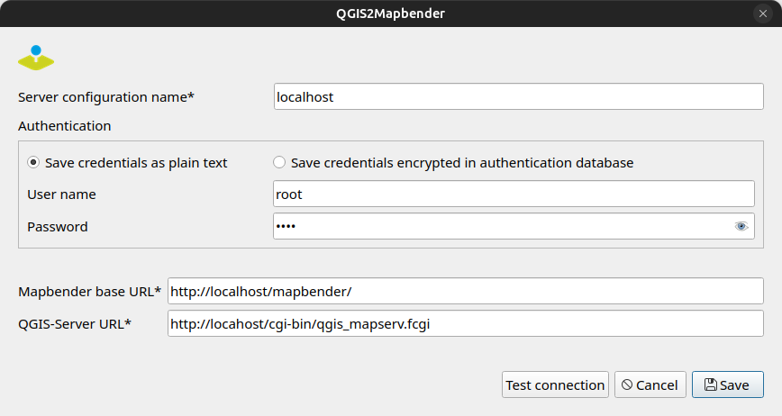

# QGIS2Mapbender

## Description
The QGIS2Mapbender plugin transfers your your local QGIS project on a server and publishs the QGIS Server WMS in a Mapbender application.

## Installation and Requirements

### Installing the plugin
QGIS2Mapbender is publied in the QGIS plugin repository. The installation is possible directly from the QGIS plugin repository via the QGIS Plugin Manager. Click on the menu item **Plugins ► Manage and Install Plugins**.
Alternatively, a release can be downloaded here. The zipped folder can be installed manually. Click on the menu item **Plugins  ► Manage and Install Plugins**. Select the **Not Installed option** in the Plugin Manager dialog and upload the zip.

### Requirements on your local system
- The QGIS project must be saved in the same folder as the data.

### Requirements on your server
- QGIS Server is installed on your server
- Mapbender is installed and configured on your server 

### Requirements for your Mapbender installation

**Apache**
- Configure Apache authorisation and upload directory (see https://doc.mapbender.org/en/customization/api.html)

**PHP**
- Configure the following parameters in php.ini to match the characteristics of the projects you plan to upload to the server. Remember that the folder containing your project and data will be zipped for uploading to the server.

  - **upload_max_filesize** - the maximum size of an uploaded file. 
  - **post_max_size** - maximum size of all data sent via a POST request, its value should be equal to or greater than upload_max_filesize
  - **max_execution_tine** - this sets the maximum time in seconds a script is allowed to parse input data.

**Mapbender**

- Application: Create at least one template application in Mapbender (that can be copied and can be used to publish a new WMS) or an application that will be used directly to publish a new WMS. 

- The applications should have at least one instance of a map and one layerset.
  
 Note: The field "layerset" in QGIS2Mapbender is the id or name of the layerset to use. Defaults are "main" or the first layerset in the application.

- User/Groups: All Mapbender users that should be authorized to use QGIS2Mapbender need special rights. There is only one exception and this is the Mapbender super user with the id 1, where this permission is automatically granted. 

  - User/group needs to have the global permission **access_api** and **upload_files** in order to perform any operation on the API and to be able to upload files.
  - User/group needs the global permission **create_applications** 
  - User/group needs the global permission **view_sources**  
  - User/group need to have **view** rights on the template application 

### Configuring the connection to the server 

The figure below shows a typical configuration of the connection to the server.

A few comments on a standard configuration:

| **Parameter**          | **Description**                                           | **Example**                          |
|------------------------|-----------------------------------------------------------|-----------------------------------------------|
| **Mapbender base URL** | Link to your Mapbender landing page (application overview) | http://localhost/mapbender/  |                                                                                                                                  |
| **QGIS Server URL**   | URL to access your QGIS Server              | http://localhost/cgi-bin/qgis_mapserv.fcgi   |

## Support
info@wheregroup.com

## License
The plugin is licensed under the attached GNU General Public License.
